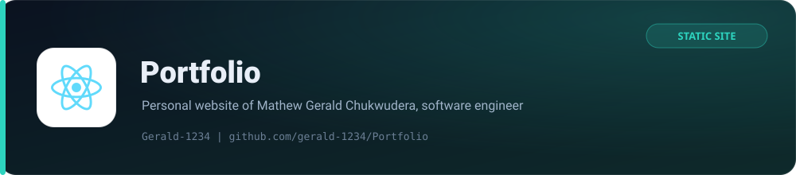

<p align="center">
  <picture>
    
  </picture>
</p>

<p align="center">
  <strong>The personal website of Mathew Gerald Chukwudera, software engineering student and full-stack developer.</strong>
</p>

<p align="center">
  <a href="https://gerald-mathew.netlify.app/"></a>
  
  
  
</p>
<p align="center">
  
  
  
</p>

A hand-built, dependency-light portfolio site. No frameworks and no build step: plain HTML, CSS and JavaScript served straight from the repository root by Netlify.

## Highlights

| Section | What it shows |
| --- | --- |
| Hero | Animated, pointer-reactive particle canvas and a short positioning statement |
| About | Background, focus areas and engineering values |
| Projects | Selected work with links to live demos and source |
| Skills | Languages, frameworks and tooling |
| Contact | Direct links plus a thank-you confirmation page |

## Tech stack

| Layer | Choice | Why |
| --- | --- | --- |
| Markup | Hand-written HTML5 | Full control, zero build tooling |
| Styling | Modern CSS (custom properties, grid, flexbox) | No preprocessor needed |
| Behaviour | Vanilla JavaScript | Small, fast, no runtime dependencies |
| Icons | [Lucide](https://lucide.dev/) via CDN | Crisp SVG icons |
| Hosting | Netlify | Static hosting, security headers and redirects as code |

## Project structure

```text
.
├── index.html              # one-page portfolio
├── thanks.html             # form confirmation page
├── 404.html                # custom not-found page
├── script.js               # scroll state, menu, reveal animations, canvas
├── style.css               # design tokens and layout
├── netlify.toml            # headers, redirects and cache policy
├── robots.txt              # crawler policy
├── sitemap.xml             # single-page sitemap
├── site.webmanifest        # PWA metadata
└── images/                 # favicons, app icons and hero photo
```

## Run locally

No tooling required. Serve the folder with any static server:

```bash
python3 -m http.server 8080
# then open http://localhost:8080
```

Opening `index.html` directly from disk also works, though the Netlify headers and redirects only apply when the site is served by Netlify.

## Deployment

Netlify is configured as code in `netlify.toml`:

- `publish = "."` publishes the repository root.
- A catch-all rewrite serves `index.html` for unknown routes.
- Security headers include a `Content-Security-Policy`, `X-Frame-Options`, `X-Content-Type-Options` and a strict referrer policy.
- Long-lived immutable caching for images and icons, one-week caching for CSS and JavaScript.

Pushing to the default branch triggers a deploy.

## Performance notes

The hero photograph is pre-scaled to a 1400 px long edge and compressed (roughly 220 KB, down from over 3 MB). The particle canvas caps its device-pixel ratio at 2 and stops animating entirely when the visitor prefers reduced motion.

## License

Released under the [MIT License](LICENSE).

<p align="center"><sub>Built and maintained by <a href="https://github.com/Gerald-1234">Gerald-1234</a></sub></p>
